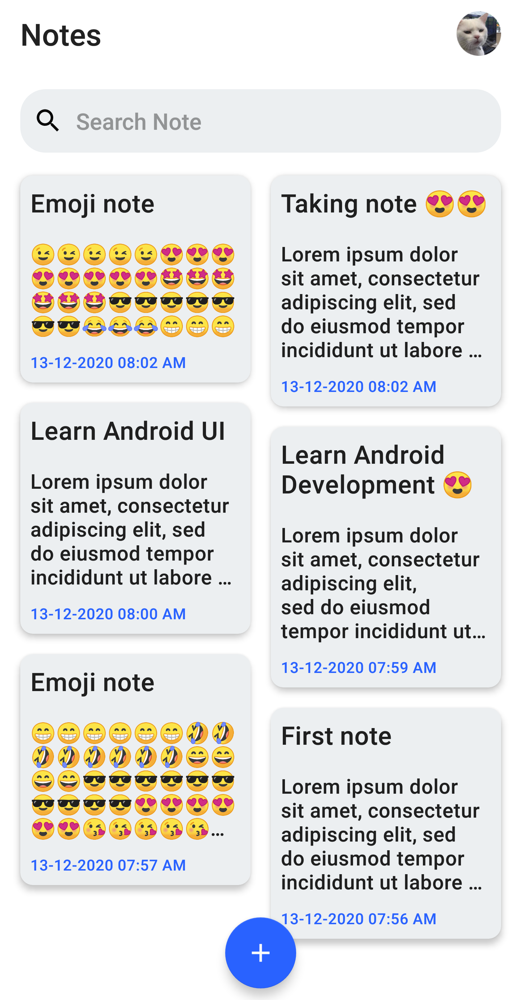
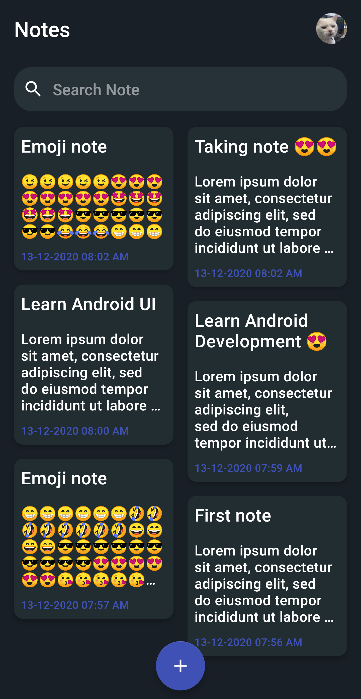

# Notes
#### Notes is a simple note-taking app using firebase.

Day mode | Night mode
--------- | ---------
 |
 
### :warning: Wraning !
#### Before run the repository, make sure to add google.json under the app directory.

## Used libraries 
1. Navigation architecture
1. View binding
1. Dagger hilt
1. Coil for image loading
1. View model and Live Date
1. Some material custom theme

## How to use it
1. Clone this repository
1. Create project in firebase
1. Enable google sign in authentication
1. Connect repository with the firebase
